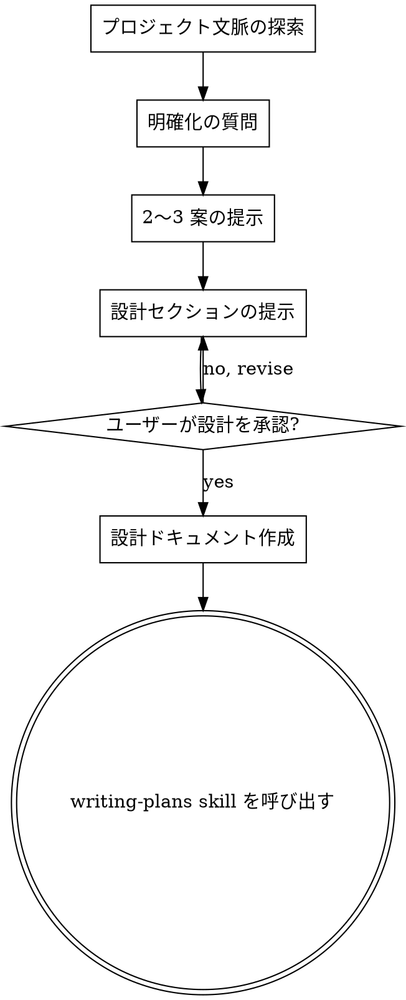

# アイデアを設計へ

## 概要

自然な対話を通じて、アイデアを完全な設計と仕様へ昇華させる。

まず現在のプロジェクト文脈を理解し、一度に 1 つずつ質問してアイデアを具体化する。何を作るか理解できたら設計を提示し、ユーザー承認を得る。

<HARD-GATE>
設計を提示しユーザーが承認するまで、実装 skill の呼び出し、コード記述、プロジェクトのスキャフォールド、いかなる実装アクションも行わない。認識上の単純さに関わらず、すべてのプロジェクトに適用する。
</HARD-GATE>

## アンチパターン: 「設計不要なほど単純」

すべてのプロジェクトがこのプロセスを通る。todo リスト、単一関数ユーティリティ、設定変更 — すべて。「単純」なプロジェクトこそ、未検証の前提が最も無駄な作業を生む。設計は短くてよい（本当に単純なら数文で足りる）が、**必ず** 提示して承認を得る。

## チェックリスト

次の各項目について todo を作成し、順番に完了する:

1. **プロジェクト文脈の探索** — ファイル、ドキュメント、直近の commit を確認
2. **明確化の質問** — 一度に 1 つ、目的・制約・成功基準を理解
3. **2〜3 案の提示** — トレードオフと推奨案を含める
4. **設計の提示** — 複雑さに応じたセクションで、各セクション後に承認を得る
5. **設計ドキュメントの作成** — `docs/plans/YYYY-MM-DD-<topic>-design.md` に保存して commit
6. **実装への移行** — writing-plans skill を呼び出して実装計画を作成

## プロセスフロー

**終端状態は writing-plans の呼び出し。** frontend-design、mcp-builder、その他の実装 skill は呼び出さない。brainstorming の後に呼び出す skill は writing-plans **のみ**。

## プロセス

**アイデアの理解:**
- まず現在のプロジェクト状態を確認（ファイル、ドキュメント、直近の commit）
- 一度に 1 つずつ質問してアイデアを具体化
- 可能なら選択式を優先。自由記述も可
- 1 メッセージ 1 質問 — 深掘りが必要なら複数に分割
- 目的、制約、成功基準の理解に集中

**アプローチの探索:**
- 2〜3 の異なるアプローチとトレードオフを提示
- 推奨案と理由を会話形式で提示
- 推奨案を先に示し、理由を説明

**設計の提示:**
- 何を作るか理解できたら設計を提示
- セクションの長さは複雑さに応じる: 単純なら数文、複雑なら 200〜300 語
- 各セクション後に「ここまで問題ないか」を確認
- アーキテクチャ、コンポーネント、データフロー、エラー処理、テストをカバー
- 不明点があれば戻って明確化する

## 設計後

**ドキュメント:**
- 確定した設計を `docs/plans/YYYY-MM-DD-<topic>-design.md` に書く
- 利用可能なら elements-of-style:writing-clearly-and-concisely skill を使う
- 設計ドキュメントを git に commit

**実装:**
- writing-plans skill を呼び出して詳細な実装計画を作成
- 他の skill は呼び出さない。次のステップは writing-plans。

## 重要な原則

- **一度に 1 質問** — 複数質問で圧倒しない
- **選択式を優先** — 可能なら自由記述より答えやすい
- **YAGNI を徹底** — 不要な機能を設計から除外
- **代替案を探索** — 決める前に必ず 2〜3 案を提示
- **段階的な検証** — 設計を提示し、進む前に承認を得る
- **柔軟に** — 不明点があれば戻って明確化
