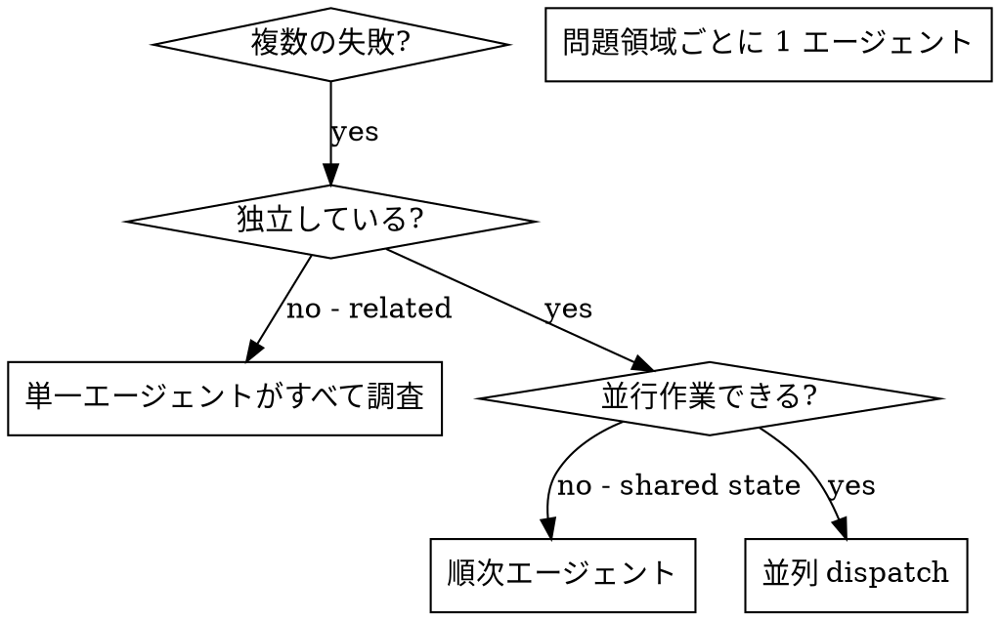

# 並列エージェントの dispatch

## 概要

無関係な複数の失敗（異なるテストファイル、サブシステム、バグ）を順次調査すると時間の無駄。各調査は独立して並行可能。

**中核原則:** 独立した問題領域ごとに 1 エージェントを dispatch。同時に作業させる。

## いつ使うか



**使う場合:**
- 3 件以上のテストファイルが異なる根本原因で失敗
- 複数サブシステムが独立して壊れている
- 各問題は他の文脈なしで理解できる
- 調査間に共有状態がない

**使わない場合:**
- 失敗が関連（1 件直せば他も直るかも）
- システム全体の状態理解が必要
- エージェントが互いに干渉する

## パターン

### 1. 独立領域の特定

失敗を壊れているものでグループ化:
- ファイル A のテスト: Tool approval フロー
- ファイル B のテスト: Batch completion 挙動
- ファイル C のテスト: Abort 機能

各領域は独立 — tool approval の修正は abort テストに影響しない。

### 2. 焦点を絞ったエージェントタスクの作成

各エージェントに:
- **特定スコープ:** 1 テストファイルまたはサブシステム
- **明確な目標:** これらのテストを通す
- **制約:** 他コードを変更しない
- **期待出力:** 発見と修正の要約

### 3. 並列 dispatch

```typescript
// In Claude Code / AI environment
Task("Fix agent-tool-abort.test.ts failures")
Task("Fix batch-completion-behavior.test.ts failures")
Task("Fix tool-approval-race-conditions.test.ts failures")
// All three run concurrently
```

### 4. レビューと統合

エージェントが戻ったら:
- 各要約を読む
- 修正が競合しないか検証
- 全テストスイートを実行
- すべての変更を統合

## エージェントプロンプト構造

良いエージェントプロンプトは:
1. **焦点を絞る** — 1 つの明確な問題領域
2. **自己完結** — 問題理解に必要な全コンテキスト
3. **出力が具体的** — エージェントは何を返すべきか？

```markdown
Fix the 3 failing tests in src/agents/agent-tool-abort.test.ts:

1. "should abort tool with partial output capture" - expects 'interrupted at' in message
2. "should handle mixed completed and aborted tools" - fast tool aborted instead of completed
3. "should properly track pendingToolCount" - expects 3 results but gets 0

These are timing/race condition issues. Your task:

1. Read the test file and understand what each test verifies
2. Identify root cause - timing issues or actual bugs?
3. Fix by:
   - Replacing arbitrary timeouts with event-based waiting
   - Fixing bugs in abort implementation if found
   - Adjusting test expectations if testing changed behavior

Do NOT just increase timeouts - find the real issue.

Return: Summary of what you found and what you fixed.
```

## よくある間違い

**❌ 広すぎる:** 「すべてのテストを直して」— エージェントが迷子
**✅ 具体的:** 「agent-tool-abort.test.ts を直して」— 焦点を絞ったスコープ

**❌ コンテキストなし:** 「レース条件を直して」— どこか分からない
**✅ コンテキスト:** エラーメッセージとテスト名を貼る

**❌ 制約なし:** エージェントが全部リファクタするかも
**✅ 制約:** 「本番コードを変更しない」または「テストのみ修正」

**❌ 出力が曖昧:** 「直して」— 何が変わったか分からない
**✅ 具体的:** 「根本原因と変更の要約を返す」

## 使わない場合

**関連する失敗:** 1 件直せば他も直るかも — まず一緒に調査
**全体文脈が必要:** システム全体を見ないと理解できない
**探索的 debug:** 何が壊れているかまだ分からない
**共有状態:** エージェントが干渉（同一ファイル編集、同一リソース）

## セッションからの実例

**シナリオ:** 大規模リファクタ後、3 ファイルで 6 テスト失敗

**失敗:**
- agent-tool-abort.test.ts: 3 失敗（タイミング問題）
- batch-completion-behavior.test.ts: 2 失敗（tool が実行されない）
- tool-approval-race-conditions.test.ts: 1 失敗（execution count = 0）

**判断:** 独立領域 — abort ロジック、batch completion、race condition は別

**dispatch:**
```
Agent 1 → agent-tool-abort.test.ts を修正
Agent 2 → batch-completion-behavior.test.ts を修正
Agent 3 → tool-approval-race-conditions.test.ts を修正
```

**結果:**
- Agent 1: 任意 timeout を event-based waiting に置換
- Agent 2: event 構造バグ修正（threadId の位置が間違い）
- Agent 3: 非同期 tool 実行完了の wait を追加

**統合:** すべての修正が独立、競合なし、全スイート green

**節約時間:** 3 問題を並列で解決 vs 順次

## 主な利点

1. **並列化** — 複数調査が同時進行
2. **焦点** — 各エージェントのスコープが狭く、追うコンテキストが少ない
3. **独立性** — エージェントが互いに干渉しない
4. **速度** — 3 問題を 1 問題分の時間で

## 検証

エージェントが戻った後:
1. **各要約をレビュー** — 何が変わったか理解
2. **競合確認** — 同じコードを編集していないか
3. **全スイート実行** — すべての修正が一緒に動くか
4. **スポットチェック** — エージェントは体系的ミスをしうる

## 実世界への影響

debug セッションより（2025-10-03）:
- 3 ファイルで 6 失敗
- 3 エージェントを並列 dispatch
- すべての調査が同時完了
- すべての修正を統合成功
- エージェント変更間の競合ゼロ
