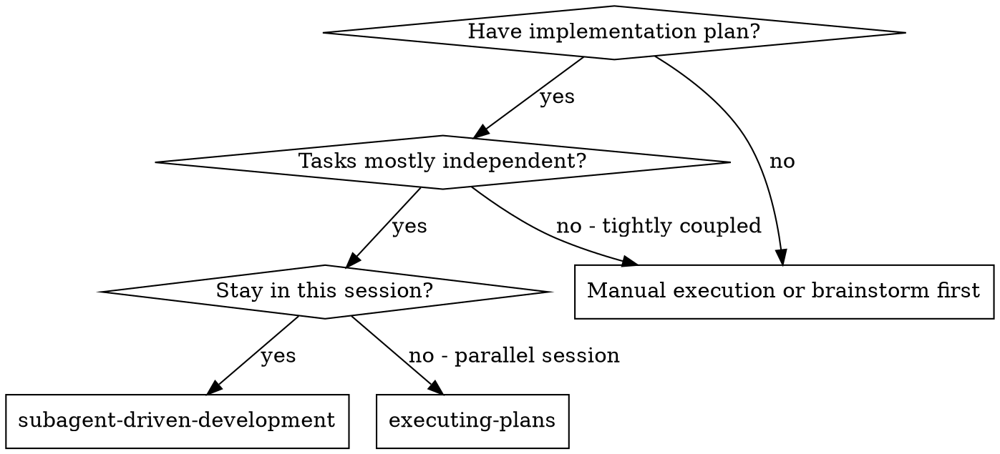
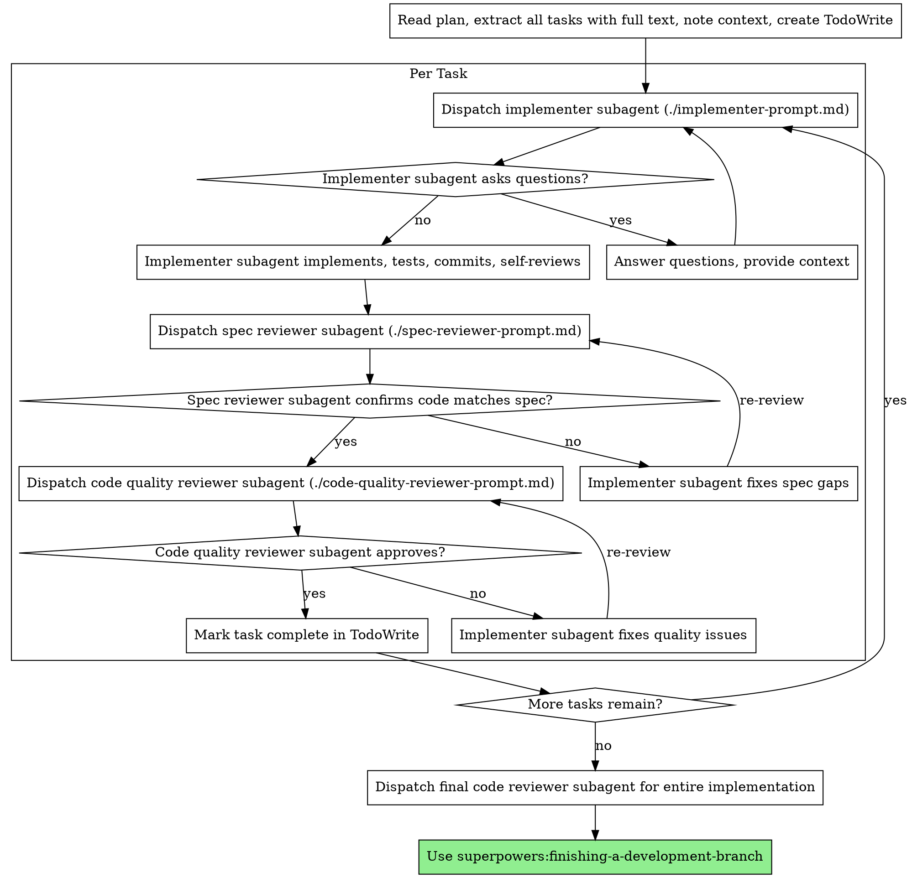

# サブエージェント駆動開発

計画を実行するときは、タスクごとに fresh なサブエージェントを dispatch し、各タスク後に 2 段階レビューを行います。まず spec 準拠レビュー、次にコード品質レビューです。

**核心原則:** タスクごとに fresh なサブエージェント + 2 段階レビュー（spec → 品質）= 高品質かつ高速な反復

## 発火条件



**executing-plans（並列セッション）との違い:**
- 同一セッション（コンテキスト切り替えなし）
- タスクごとに fresh なサブエージェント（コンテキスト汚染なし）
- 各タスク後に 2 段階レビュー: まず spec 準拠、次にコード品質
- より高速な反復（タスク間に human-in-loop 不要）

## プロセス



## プロンプトテンプレート

- `./implementer-prompt.md` - 実装者サブエージェントの dispatch
- `./spec-reviewer-prompt.md` - spec 準拠レビュアーサブエージェントの dispatch
- `./code-quality-reviewer-prompt.md` - コード品質レビュアーサブエージェントの dispatch

## ワークフロー例

```
You: I'm using Subagent-Driven Development to execute this plan.

[Read plan file once: docs/plans/feature-plan.md]
[Extract all 5 tasks with full text and context]
[Create TodoWrite with all tasks]

Task 1: Hook installation script

[Get Task 1 text and context (already extracted)]
[Dispatch implementation subagent with full task text + context]

Implementer: "Before I begin - should the hook be installed at user or system level?"

You: "User level (~/.config/superpowers/hooks/)"

Implementer: "Got it. Implementing now..."
[Later] Implementer:
  - Implemented install-hook command
  - Added tests, 5/5 passing
  - Self-review: Found I missed --force flag, added it
  - Committed

[Dispatch spec compliance reviewer]
Spec reviewer: ✅ Spec compliant - all requirements met, nothing extra

[Get git SHAs, dispatch code quality reviewer]
Code reviewer: Strengths: Good test coverage, clean. Issues: None. Approved.

[Mark Task 1 complete]

Task 2: Recovery modes

[Get Task 2 text and context (already extracted)]
[Dispatch implementation subagent with full task text + context]

Implementer: [No questions, proceeds]
Implementer:
  - Added verify/repair modes
  - 8/8 tests passing
  - Self-review: All good
  - Committed

[Dispatch spec compliance reviewer]
Spec reviewer: ❌ Issues:
  - Missing: Progress reporting (spec says "report every 100 items")
  - Extra: Added --json flag (not requested)

[Implementer fixes issues]
Implementer: Removed --json flag, added progress reporting

[Spec reviewer reviews again]
Spec reviewer: ✅ Spec compliant now

[Dispatch code quality reviewer]
Code reviewer: Strengths: Solid. Issues (Important): Magic number (100)

[Implementer fixes]
Implementer: Extracted PROGRESS_INTERVAL constant

[Code reviewer reviews again]
Code reviewer: ✅ Approved

[Mark Task 2 complete]

...

[After all tasks]
[Dispatch final code-reviewer]
Final reviewer: All requirements met, ready to merge

Done!
```

## メリット

**手動実行との比較:**
- サブエージェントは TDD を自然に守る
- タスクごとに fresh なコンテキスト（混乱なし）
- 並列安全（サブエージェント同士が干渉しない）
- サブエージェントは質問できる（作業前と作業中の両方）

**executing-plans との比較:**
- 同一セッション（handoff なし）
- 継続的な進捗（待ち時間なし）
- レビューチェックポイントが自動

**効率面:**
- ファイル読み取りオーバーヘッドなし（controller が全文を提供）
- controller が必要なコンテキストだけを厳選
- サブエージェントは最初から完全な情報を得る
- 作業開始前に質問が表面化（事後ではない）

**品質ゲート:**
- セルフレビューで handoff 前に問題を捕捉
- 2 段階レビュー: spec 準拠、次にコード品質
- レビューループで修正が実際に効いていることを保証
- spec 準拠で過不足のない実装を防ぐ
- コード品質で実装がよく作られていることを保証

**コスト:**
- サブエージェント呼び出しが増える（タスクごとに implementer + 2 reviewers）
- controller の準備作業が増える（事前に全タスクを抽出）
- レビューループで反復が増える
- ただし早期に問題を捕捉できる（後から debug するより安い）

## レッドフラグ

**絶対にやらない:**
- ユーザーの明示的同意なしに main/master で実装を開始
- レビューを省略（spec 準拠 OR コード品質）
- 未修正の issue があるまま進む
- 複数の実装サブエージェントを並列 dispatch（競合）
- サブエージェントに plan ファイルを読ませる（代わりに全文を渡す）
- シーン設定コンテキストを省略（タスクの位置づけを理解させる）
- サブエージェントの質問を無視（進める前に回答）
- spec 準拠で「だいたい OK」を許容（reviewer が issue を見つけた = 未完了）
- レビューループを省略（reviewer が issue を見つけた = implementer が修正 = 再レビュー）
- implementer のセルフレビューで実レビューを置き換える（両方必要）
- **spec 準拠が ✅ になる前にコード品質レビューを開始**（順序が逆）
- どちらかのレビューに未解決 issue があるまま次タスクへ進む

**サブエージェントが質問した場合:**
- 明確かつ完全に回答
- 必要なら追加コンテキストを提供
- 実装へ急がせない

**reviewer が issue を見つけた場合:**
- implementer（同一サブエージェント）が修正
- reviewer が再レビュー
- 承認されるまで繰り返す
- 再レビューを省略しない

**サブエージェントがタスクに失敗した場合:**
- 具体的な指示付きで fix サブエージェントを dispatch
- 手動で直さない（コンテキスト汚染）

## 連携

**必須 workflow skill:**
- **superpowers:using-git-worktrees** - 必須: 開始前に隔離 workspace を用意
- **superpowers:writing-plans** - この skill が実行する plan を作成
- **superpowers:requesting-code-review** - reviewer サブエージェント向け code review テンプレート
- **superpowers:finishing-a-development-branch** - 全タスク完了後の開発完了

**サブエージェントが使う skill:**
- **superpowers:test-driven-development** - 各タスクで TDD に従う

**代替 workflow:**
- **superpowers:executing-plans** - 同一セッションではなく並列セッションで実行するとき
