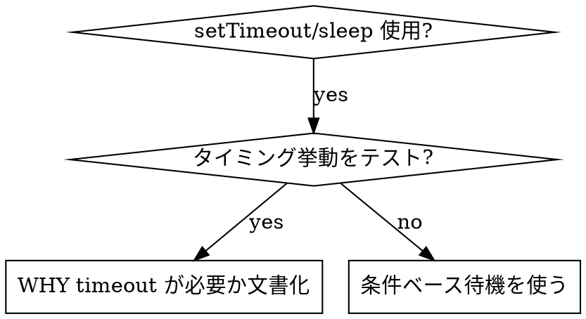

# 条件ベース待機

## 概要

flaky テストは任意 delay でタイミングを推測することが多い。高速マシンでは通り、負荷下や CI では失敗する race condition を生む。

**中核原則:** かかる時間の推測ではなく、**実際に気にする条件** を待つ。

## いつ使うか



**使う場合:**
- 任意 delay があるテスト（`setTimeout`、`sleep`、`time.sleep()`）
- flaky テスト（時々通る、負荷下で失敗）
- 並列実行で timeout
- 非同期操作完了を待つ

**使わない場合:**
- 実際のタイミング挙動をテスト（debounce、throttle 間隔）
- 任意 timeout を使うなら常に WHY を文書化

## コアパターン

```typescript
// ❌ BEFORE: Guessing at timing
await new Promise(r => setTimeout(r, 50));
const result = getResult();
expect(result).toBeDefined();

// ✅ AFTER: Waiting for condition
await waitFor(() => getResult() !== undefined);
const result = getResult();
expect(result).toBeDefined();
```

## クイックパターン

| シナリオ | パターン |
|----------|---------|
| イベント待ち | `waitFor(() => events.find(e => e.type === 'DONE'))` |
| state 待ち | `waitFor(() => machine.state === 'ready')` |
| 件数待ち | `waitFor(() => items.length >= 5)` |
| ファイル待ち | `waitFor(() => fs.existsSync(path))` |
| 複合条件 | `waitFor(() => obj.ready && obj.value > 10)` |

## 実装

汎用ポーリング関数:
```typescript
async function waitFor<T>(
  condition: () => T | undefined | null | false,
  description: string,
  timeoutMs = 5000
): Promise<T> {
  const startTime = Date.now();

  while (true) {
    const result = condition();
    if (result) return result;

    if (Date.now() - startTime > timeoutMs) {
      throw new Error(`Timeout waiting for ${description} after ${timeoutMs}ms`);
    }

    await new Promise(r => setTimeout(r, 10)); // Poll every 10ms
  }
}
```

完全実装とドメイン固有 helper（`waitForEvent`、`waitForEventCount`、`waitForEventMatch`）は、このディレクトリの `condition-based-waiting-example.ts` を参照。実際の debug セッション由来。

## よくある間違い

**❌ ポーリングが速すぎ:** `setTimeout(check, 1)` — CPU 浪費
**✅ 修正:** 10ms ごとにポーリング

**❌ timeout なし:** 条件が満たされなければ永久ループ
**✅ 修正:** 常に明確なエラー付き timeout

**❌ 古いデータ:** ループ前に state をキャッシュ
**✅ 修正:** ループ内で getter を呼び fresh データ

## 任意 timeout が正しい場合

```typescript
// Tool ticks every 100ms - need 2 ticks to verify partial output
await waitForEvent(manager, 'TOOL_STARTED'); // First: wait for condition
await new Promise(r => setTimeout(r, 200));   // Then: wait for timed behavior
// 200ms = 2 ticks at 100ms intervals - documented and justified
```

**要件:**
1. まずトリガー条件を待つ
2. 既知タイミングに基づく（推測ではない）
3. WHY を説明するコメント

## 実世界への影響

debug セッションより（2025-10-03）:
- 3 ファイル 15 flaky テストを修正
- 通過率: 60% → 100%
- 実行時間: 40% 短縮
- race condition 解消
