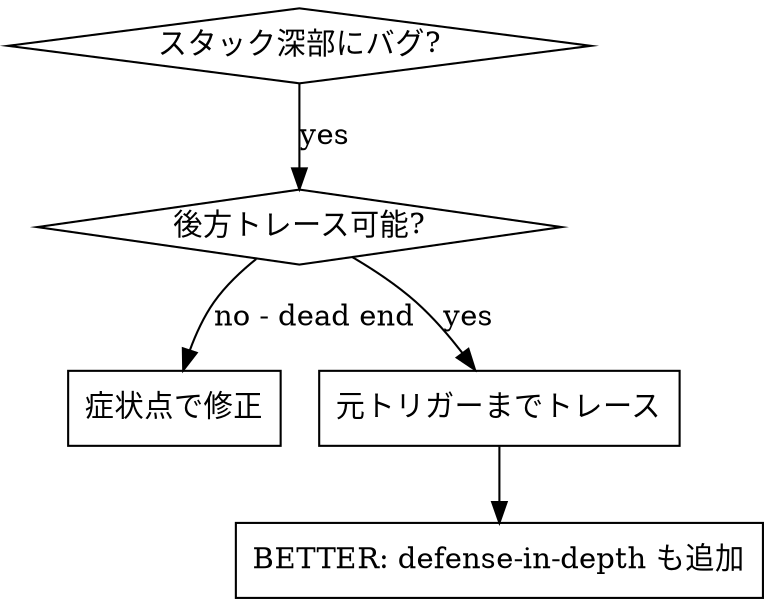
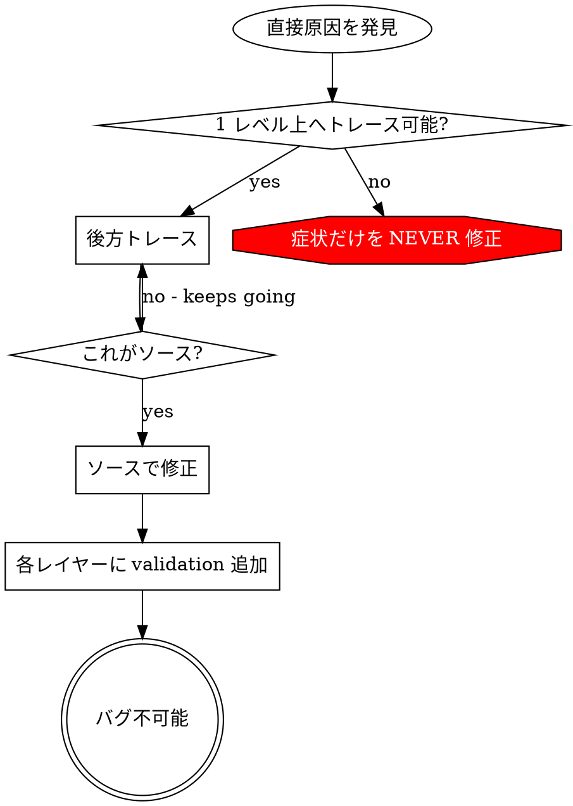

# 根本原因トレース

## 概要

バグは call stack の深部に現れることが多い（間違ったディレクトリでの git init、間違った場所のファイル作成、間違ったパスでの DB オープン）。本能はエラーが現れる場所を直すことだが、それは症状への対処。

**中核原則:** call chain を後方にトレースして元トリガーを見つけ、ソースで修正。

## いつ使うか



**使う場合:**
- 実行深部でエラー（エントリポイントではない）
- スタックトレースに長い call chain
- 無効データの発生源が不明
- どのテスト/コードが問題をトリガーするか特定が必要

## トレースプロセス

### 1. 症状の観察
```
Error: git init failed in /Users/<user>/project/packages/core
```

### 2. 直接原因の特定
**これを直接引き起こすコードは？**
```typescript
await execFileAsync('git', ['init'], { cwd: projectDir });
```

### 3. 自問: 誰がこれを呼んだ？
```typescript
WorktreeManager.createSessionWorktree(projectDir, sessionId)
  → called by Session.initializeWorkspace()
  → called by Session.create()
  → called by test at Project.create()
```

### 4. 上へトレースを続ける
**どんな値が渡された？**
- `projectDir = ''`（空文字列！）
- 空文字列を `cwd` にすると `process.cwd()` に解決
- それがソースコードディレクトリ！

### 5. 元トリガーの特定
**空文字列はどこから？**
```typescript
const context = setupCoreTest(); // Returns { tempDir: '' }
Project.create('name', context.tempDir); // Accessed before beforeEach!
```

## スタックトレースの追加

手動トレースできない場合、instrumentation を追加:

```typescript
// Before the problematic operation
async function gitInit(directory: string) {
  const stack = new Error().stack;
  console.error('DEBUG git init:', {
    directory,
    cwd: process.cwd(),
    nodeEnv: process.env.NODE_ENV,
    stack,
  });

  await execFileAsync('git', ['init'], { cwd: directory });
}
```

**重要:** テストでは `console.error()` を使う（logger ではない — 表示されないかも）

**実行してキャプチャ:**
```bash
npm test 2>&1 | grep 'DEBUG git init'
```

**スタックトレース分析:**
- テストファイル名を探す
- call をトリガーする行番号を特定
- パターンを特定（同じテスト？同じパラメータ？）

## どのテストが汚染するか特定

テスト中に現れるがどのテストか分からない場合:

このディレクトリの bisection スクリプト `find-polluter.sh` を使う:

```bash
./find-polluter.sh '.git' 'src/**/*.test.ts'
```

テストを 1 件ずつ実行し、最初の polluter で停止。用法はスクリプト参照。

## 実例: 空 projectDir

**症状:** `packages/core/`（ソースコード）に `.git` 作成

**トレース chain:**
1. `git init` が `process.cwd()` で実行 ← 空 cwd パラメータ
2. 空 projectDir で WorktreeManager 呼び出し
3. Session.create() が空文字列を渡した
4. テストが beforeEach 前に `context.tempDir` にアクセス
5. setupCoreTest() が初期 `{ tempDir: '' }` を返す

**根本原因:** トップレベル変数初期化が空値にアクセス

**修正:** tempDir を beforeEach 前アクセスで throw する getter に変更

**defense-in-depth も追加:**
- Layer 1: Project.create() がディレクトリを検証
- Layer 2: WorkspaceManager が空でないことを検証
- Layer 3: NODE_ENV ガードが tmpdir 外の git init を拒否
- Layer 4: git init 前のスタックトレース logging

## 重要原則



**エラーが現れる場所だけを NEVER 修正。** 後方トレースして元トリガーを見つける。

## スタックトレースのヒント

**テスト:** logger ではなく `console.error()` — logger は抑制されるかも
**操作前:** 失敗後ではなく危険操作前に log
**コンテキスト含める:** directory、cwd、環境変数、タイムスタンプ
**スタックキャプチャ:** `new Error().stack` で完全 call chain

## 実世界への影響

debug セッションより（2025-10-03）:
- 5 レベルトレースで根本原因発見
- ソースで修正（getter validation）
- 4 レイヤーの defense 追加
- 1847 テスト通過、汚染ゼロ
