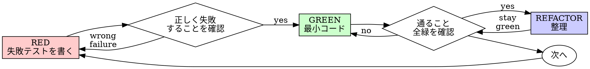

# テスト駆動開発（TDD）

## 概要

先にテストを書く。失敗を確認する。通す最小コードを書く。

**中核原則:** テストの失敗を見ていなければ、正しいことをテストしているか分からない。

**ルールの字義違反は精神違反である。**

## いつ使うか

**常に:**
- 新機能
- バグ修正
- リファクタリング
- 挙動変更

**例外（human partner に確認）:**
- 使い捨てプロトタイプ
- 生成コード
- 設定ファイル

「今回だけ TDD をスキップ」？ STOP。それは言い訳。

## 鉄則

```
FAILING TEST が先、PRODUCTION CODE は後
```

テストより先にコードを書いた？ 削除してやり直し。

**例外なし:**
- 「参考用に残す」はしない
- テストを書きながら「適応」しない
- 見ない
- 削除とは削除

テストから新規実装。以上。

## Red-Green-Refactor



### RED — 失敗テストを書く

何が起きるべきかを示す最小のテストを 1 つ書く。

<Good>
```typescript
test('retries failed operations 3 times', async () => {
  let attempts = 0;
  const operation = () => {
    attempts++;
    if (attempts < 3) throw new Error('fail');
    return 'success';
  };

  const result = await retryOperation(operation);

  expect(result).toBe('success');
  expect(attempts).toBe(3);
});
```
名前が明確、実挙動をテスト、1 つのこと
</Good>

<Bad>
```typescript
test('retry works', async () => {
  const mock = jest.fn()
    .mockRejectedValueOnce(new Error())
    .mockRejectedValueOnce(new Error())
    .mockResolvedValueOnce('success');
  await retryOperation(mock);
  expect(mock).toHaveBeenCalledTimes(3);
});
```
名前が曖昧、コードではなく mock をテスト
</Bad>

**要件:**
- 1 つの挙動
- 明確な名前
- 実コード（避けられない場合のみ mock）
- 入力境界、権限境界、ストレージ境界、ブラウザ API 境界、ユーザーデータ境界で失敗しうる場合は、エッジ・エラー・境界をカバー。1 つの曖昧なテストを広げるより、境界挙動を証明する最小の別テストを追加。

### Verify RED — 失敗を見る

**必須。スキップ禁止。**

```bash
npm test path/to/test.test.ts
```

確認:
- テストが失敗する（エラーではない）
- 失敗メッセージが期待どおり
- 機能欠如が原因（ typo ではない）

**テストが通る？** 既存挙動をテストしている。テストを修正。

**テストがエラー？** エラーを修正し、正しく失敗するまで再実行。

### GREEN — 最小コード

テストを通す最も単純なコードを書く。

<Good>
```typescript
async function retryOperation<T>(fn: () => Promise<T>): Promise<T> {
  for (let i = 0; i < 3; i++) {
    try {
      return await fn();
    } catch (e) {
      if (i === 2) throw e;
    }
  }
  throw new Error('unreachable');
}
```
通すのに足りるだけ
</Good>

<Bad>
```typescript
async function retryOperation<T>(
  fn: () => Promise<T>,
  options?: {
    maxRetries?: number;
    backoff?: 'linear' | 'exponential';
    onRetry?: (attempt: number) => void;
  }
): Promise<T> {
  // YAGNI
}
```
過剰設計
</Bad>

機能追加、他コードのリファクタ、テストを超えた「改善」はしない。

### Verify GREEN — 成功を見る

**必須。**

```bash
npm test path/to/test.test.ts
```

確認:
- テストが通る
- 他のテストも通る
- 出力がクリーン（エラー・警告なし）

**テストが失敗？** コードを修正。テストではない。

**他のテストが失敗？** 今すぐ修正。

### REFACTOR — 整理

green の後のみ:
- 重複除去
- 名前改善
- helper 抽出

テストは緑のまま。挙動は追加しない。

### 繰り返し

次の機能の次の失敗テストへ。

## 良いテスト

| 品質 | 良い | 悪い |
|---------|------|-----|
| **最小** | 1 つのこと。名前に "and"？ 分割。 | `test('validates email and domain and whitespace')` |
| **明確** | 名前が挙動を説明 | `test('test1')` |
| **意図を示す** | 望ましい API を示す | コードが何をすべきか不明 |

## 順序が重要な理由

**「動作確認後にテストを書く」**

後から書いたテストは即座に通る。即座に通ることは何も証明しない:
- 間違ったことをテストしているかも
- 挙動ではなく実装をテストしているかも
- 忘れたエッジケースを見逃しているかも
- バグを捕まえたのを見ていない

テストファーストは失敗を見せ、実際に何かをテストしていることを証明する。

**「手動ですべてのエッジケースを試した」**

手動テストは場当たり的。全部試したつもりでも:
- 何を試したか記録がない
- コード変更時に再実行できない
- プレッシャー下でケースを忘れやすい
- 「試したら動いた」≠ 網羅的

自動テストは体系的。毎回同じ方法で実行される。

**「X 時間の作業を削除するのは無駄」**

サンクコストの誤謬。時間は既に失われた。今の選択:
- 削除して TDD で書き直す（さらに X 時間、高い信頼性）
- 残して後からテスト（30 分、低い信頼性、バグの可能性）

「無駄」なのは信頼できないコードを残すこと。テストのない動くコードは技術的負債。

**「TDD は dogmatic、pragmatic なら適応」**

TDD **は** pragmatic:
- commit 前にバグ発見（後から debug より速い）
- 回帰防止（テストが即座に破壊を検知）
- 挙動のドキュメント（テストが使い方を示す）
- リファクタ可能（自由に変更、テストが破壊を検知）

「pragmatic」な近道 = 本番 debug = 遅い。

**「後からのテストも同じ目的 — spirit であって ritual ではない」**

違う。後からのテストは「これは何をするか？」に答える。テストファーストは「何をすべきか？」に答える。

後からのテストは実装に偏る。作ったものをテストし、覚えているエッジケースを検証する（覚えていない）。

テストファーストは実装前にエッジケース発見を強制。後からは全部覚えていたか検証（していない）。

30 分の後付けテスト ≠ TDD。カバレッジは得るが、テストが機能することの証明は失う。

## よくある言い訳

| 言い訳 | 現実 |
|--------|---------|
| 「テスト不要なほど単純」 | 単純なコードも壊れる。テストは 30 秒。 |
| 「後でテストする」 | 即座に通るテストは何も証明しない。 |
| 「後からでも同じ目的」 | 後から = 「何をするか？」 先 = 「何をすべきか？」 |
| 「手動ですべて試した」 | 場当たり ≠ 体系的。記録なし、再実行不可。 |
| 「X 時間削除は無駄」 | サンクコスト。未検証コードを残すのが負債。 |
| 「参考に残して先にテスト」 | 適応する。それは後からテスト。削除とは削除。 |
| 「先に探索が必要」 | 可。探索は捨て、TDD で開始。 |
| 「テストが難しい = 設計不明」 | テストに耳を傾ける。テストしにくい = 使いにくい。 |
| 「TDD は遅い」 | TDD は debug より速い。pragmatic = テストファースト。 |
| 「手動の方が速い」 | 手動はエッジケースを証明しない。変更のたびに再テスト。 |
| 「既存コードにテストなし」 | 改善している。既存コードにテストを追加。 |

## 危険信号 — STOP してやり直し

- テストより先のコード
- 実装後のテスト
- テストが即座に通る
- なぜ失敗したか説明できない
- 「後で」追加したテスト
- 「今回だけ」の言い訳
- 「手動ですべて試した」
- 「後からでも同じ目的」
- 「spirit であって ritual ではない」
- 「参考に残す」「既存コードを適応」
- 「既に X 時間、削除は無駄」
- 「TDD は dogmatic、自分は pragmatic」
- 「今回は違うから…」

**これらすべて = コードを削除。TDD でやり直し。**

## 例: バグ修正

**バグ:** 空メールが受理される

**RED**
```typescript
test('rejects empty email', async () => {
  const result = await submitForm({ email: '' });
  expect(result.error).toBe('Email required');
});
```

**Verify RED**
```bash
$ npm test
FAIL: expected 'Email required', got undefined
```

**GREEN**
```typescript
function submitForm(data: FormData) {
  if (!data.email?.trim()) {
    return { error: 'Email required' };
  }
  // ...
}
```

**Verify GREEN**
```bash
$ npm test
PASS
```

**REFACTOR**
複数フィールドが必要なら validation を抽出。

## 検証チェックリスト

作業完了前:

- [ ] 新しい関数/メソッドすべてにテストがある
- [ ] 実装前に各テストの失敗を確認した
- [ ] 各テストが期待理由（機能欠如、 typo ではない）で失敗した
- [ ] 各テストを通す最小コードを書いた
- [ ] すべてのテストが通る
- [ ] 出力がクリーン（エラー・警告なし）
- [ ] 実コードを使うテスト（避けられない場合のみ mock）
- [ ] エッジケースとエラーをカバー

すべてチェックできない？ TDD をスキップした。やり直し。

## 行き詰まったとき

| 問題 | 解決策 |
|---------|----------|
| テストの書き方が分からない | 望む API を書く。先に assertion。human partner に聞く。 |
| テストが複雑すぎる | 設計が複雑すぎる。インターフェースを簡素化。 |
| 全部 mock しないと | 結合が強すぎる。dependency injection を使う。 |
| セットアップが巨大 | helper を抽出。それでも複雑なら設計を簡素化。 |

## debug との連携

バグ発見？ 再現する失敗テストを書く。TDD サイクルに従う。テストが修正を証明し回帰を防ぐ。

テストなしでバグを直さない。

## テストのアンチパターン

mock やテストユーティリティを追加するときは @testing-anti-patterns.md を読み、よくある落とし穴を避ける:
- 実挙動ではなく mock 挙動をテスト
- 本番クラスにテスト専用メソッド追加
- 依存を理解せず mock

## 最終ルール

```
Production code → テストが存在し先に失敗した
それ以外 → TDD ではない
```

human partner の許可なしに例外なし。
