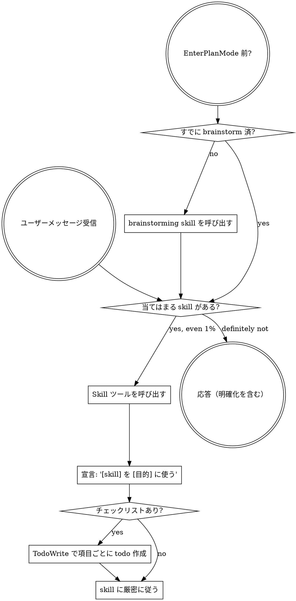

<EXTREMELY-IMPORTANT>
skill が 1% でも当てはまりそうなら、**必ず** skill を呼び出してください。

skill がタスクに当てはまるなら、選択の余地はありません。**使わなければなりません。**

これは交渉の余地がありません。任意ではありません。言い訳して回避できません。
</EXTREMELY-IMPORTANT>

## skill へのアクセス方法

**Claude Code では:** `Skill` ツールを使います。skill を呼び出すと内容が読み込まれ提示されるので、そのまま従ってください。skill ファイルに Read ツールは使わないでください。

**その他の環境では:** プラットフォームのドキュメントで skill の読み込み方法を確認してください。

# skill の使い方

## ルール

**応答やアクションの前に、関連する skill または依頼された skill を呼び出す。** 1% でも当てはまりそうなら呼び出して確認する。呼び出した skill が状況に合わなければ、使わなくてよい。

## 危険信号

次の考えは **STOP** — 言い訳しているサインです:

| 考え | 現実 |
|---------|---------|
| 「単純な質問だから」 | 質問もタスク。skill を確認する。 |
| 「先にコンテキストが必要」 | skill 確認は明確化の質問より前。 |
| 「先にコードベースを探索しよう」 | skill が探索の仕方を教える。先に確認。 |
| 「git/ファイルをすぐ確認できる」 | ファイルに会話コンテキストはない。skill を確認。 |
| 「先に情報を集めよう」 | skill が情報収集の仕方を教える。 |
| 「正式な skill は不要」 | skill があれば使う。 |
| 「skill を覚えている」 | skill は進化する。現行版を読む。 |
| 「これはタスクに当たらない」 | アクション = タスク。skill を確認。 |
| 「skill は大げさ」 | 単純なことも複雑化する。使う。 |
| 「この 1 件だけ先にやる」 | 何かする前に確認。 |
| 「生産的に感じる」 | 規律のない行動は時間の無駄。skill が防ぐ。 |
| 「意味は分かっている」 | 概念を知る ≠ skill を使う。呼び出す。 |

## skill の優先順位

複数の skill が当てはまる場合、この順序で使います:

1. **プロセス skill を先に**（brainstorming、debugging）— タスクへの進め方を決める
2. **実装 skill を次に**（frontend-design、mcp-builder）— 実行を導く

「X を作ろう」→ 先に brainstorming、次に実装 skill。
「このバグを直して」→ 先に debugging、次にドメイン固有 skill。

## skill の種類

**厳格**（TDD、debugging）: 厳密に従う。規律を緩めない。

**柔軟**（パターン）: 原則を文脈に合わせて適用。

どちらかは skill 自身が示す。

## ユーザー指示

指示は **何を** するかであり、**どう** するかではない。「X を追加」「Y を修正」でもワークフローを省略しない。
