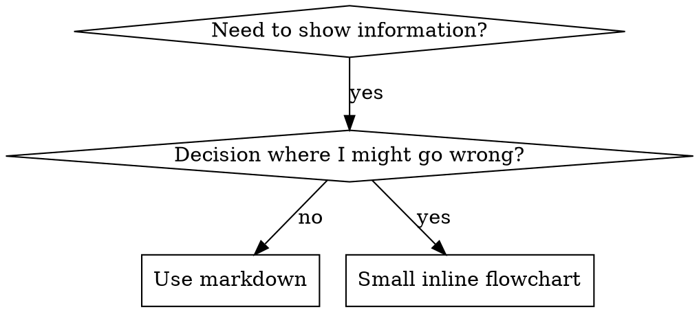

# skill の執筆

## 概要

**Skill の執筆は、プロセス文書への TDD 適用そのものです。**

**個人 skill はエージェント固有ディレクトリに置く（Claude Code は `~/.claude/skills`、Codex は `~/.agents/skills/`）**

test case（サブエージェント付き pressure scenario）を書き、失敗を観察（baseline 行動）、skill（文書）を書き、pass を観察（エージェント compliance）、refactor（loophole を塞ぐ）。

**核心原則:** skill なしでエージェントが失敗するのを見ていなければ、skill が正しいことを教えているか分からない。

**必須前提:** この skill を使う前に superpowers:test-driven-development を理解すること。そちらが RED-GREEN-REFACTOR サイクルを定義。この skill は TDD を文書執筆に適用する。

**公式ガイダンス:** Anthropic 公式の skill 執筆 best practice は anthropic-best-practices.md を参照。この文書は TDD 中心アプローチを補う追加パターンとガイドライン。

## Skill とは

**skill** は、実証済み技法、パターン、ツールのリファレンスガイド。将来の Claude instance が効果的なアプローチを見つけ適用するのに役立つ。

**Skill は:** 再利用可能な技法、パターン、ツール、リファレンスガイド

**Skill ではない:** 一度問題を解えた話のナラティブ

## Skill 作成の TDD 対応

| TDD 概念 | Skill 作成 |
|-------------|----------------|
| **Test case** | サブエージェント付き pressure scenario |
| **Production code** | Skill 文書（SKILL.md） |
| **Test fails (RED)** | skill なしでエージェントがルール違反（baseline） |
| **Test passes (GREEN)** | skill ありで compliance |
| **Refactor** | compliance を維持し loophole を塞ぐ |
| **Write test first** | skill 執筆前に baseline scenario 実行 |
| **Watch it fail** | エージェントの rationalization を verbatim 記録 |
| **Minimal code** | その違反に対処する skill を書く |
| **Watch it pass** | compliance を検証 |
| **Refactor cycle** | 新 rationalization → 塞ぐ → 再検証 |

skill 作成プロセス全体が RED-GREEN-REFACTOR に従う。

## Skill を作るタイミング

**作る:**
- 技法が直感的でなかった
- 複数プロジェクトで再参照する
- パターンが広く適用可能（プロジェクト固有でない）
- 他者にも有益

**作らない:**
- 一度きりの解決
- 他で十分文書化された標準 practice
- プロジェクト固有 convention（CLAUDE.md へ）
- 機械的制約（regex/validation で enforce できるなら自動化 — 文書は判断に留める）

## Skill タイプ

### Technique
手順付きの具体的方法（condition-based-waiting、root-cause-tracing）

### Pattern
問題への考え方（flatten-with-flags、test-invariants）

### Reference
API docs、syntax guide、ツール文書（office docs）

## ディレクトリ構成

```
skills/
  skill-name/
    SKILL.md              # Main reference (required)
    supporting-file.*     # Only if needed
```

**フラット namespace** — すべての skill を 1 つの検索可能 namespace に

**別ファイルに分ける:**
1. **Heavy reference**（100+ 行）— API docs、包括的 syntax
2. **Reusable tools** — Scripts、utilities、templates

**インラインに置く:**
- 原則と概念
- コードパターン（< 50 行）
- その他すべて

## SKILL.md 構成

**Frontmatter (YAML):**
- サポートは `name` と `description` の 2 フィールドのみ
- 合計最大 1024 文字
- `name`: 英字、数字、ハイフンのみ（括弧、特殊文字不可）
- `description`: 三人称、**いつ使うか**のみ（何をするかではない）
  - "Use when..." で始め発火条件に集中
  - 具体的 symptom、状況、コンテキストを含める
  - **skill のプロセスや workflow を要約しない**（CSO 節参照）
  - 可能なら 500 文字未満

```markdown
---
name: Skill-Name-With-Hyphens
description: Use when [specific triggering conditions and symptoms]
---

# Skill Name

## Overview
What is this? Core principle in 1-2 sentences.

## When to Use
[Small inline flowchart IF decision non-obvious]

Bullet list with SYMPTOMS and use cases
When NOT to use

## Core Pattern (for techniques/patterns)
Before/after code comparison

## Quick Reference
Table or bullets for scanning common operations

## Implementation
Inline code for simple patterns
Link to file for heavy reference or reusable tools

## Common Mistakes
What goes wrong + fixes

## Real-World Impact (optional)
Concrete results
```

## Claude Search Optimization (CSO)

**発見に critical:** 将来の Claude が skill を見つける必要がある

### 1. 充実した Description フィールド

**目的:** Claude は description でどの skill を load するか決める。「今この skill を読むべきか？」に答える。

**形式:** "Use when..." で始め発火条件に集中

**重要: Description = いつ使うか。Skill が何をするかではない**

description は発火条件のみ。skill のプロセスや workflow を要約しない。

**なぜ重要か:** description が workflow を要約すると、Claude が description に従い full skill を読まない。description が「タスク間 code review」と言うと 1 回だけ review したが、skill の flowchart は 2 段階（spec 準拠 → 品質）を示していた。

description を「Use when executing implementation plans with independent tasks」（workflow 要約なし）に変えると、flowchart を正しく読み 2 段階 review に従った。

**罠:** workflow を要約する description は shortcut になり、skill 本文は skip される。

```yaml
# ❌ BAD: Summarizes workflow - Claude may follow this instead of reading skill
description: Use when executing plans - dispatches subagent per task with code review between tasks

# ❌ BAD: Too much process detail
description: Use for TDD - write test first, watch it fail, write minimal code, refactor

# ✅ GOOD: Just triggering conditions, no workflow summary
description: Use when executing implementation plans with independent tasks in the current session

# ✅ GOOD: Triggering conditions only
description: Use when implementing any feature or bugfix, before writing implementation code
```

**内容:**
- この skill が当てはまる concrete trigger、symptom、状況
- *言語固有 symptom*（setTimeout、sleep）ではなく*問題*（race condition、不安定な pass/fail）を述べる
- skill 自体が technology-specific でなければ trigger も technology-agnostic
- technology-specific なら trigger で明示
- 三人称（system prompt に注入）
- **skill のプロセスや workflow を要約しない**

```yaml
# ❌ BAD: Too abstract, vague, doesn't include when to use
description: For async testing

# ❌ BAD: First person
description: I can help you with async tests when they're flaky

# ❌ BAD: Mentions technology but skill isn't specific to it
description: Use when tests use setTimeout/sleep and are flaky

# ✅ GOOD: Starts with "Use when", describes problem, no workflow
description: Use when tests have race conditions, timing dependencies, or pass/fail inconsistently

# ✅ GOOD: Technology-specific skill with explicit trigger
description: Use when using React Router and handling authentication redirects
```

### 2. キーワードカバレッジ

Claude が検索しそうな語を使う:
- エラーメッセージ: "Hook timed out", "ENOTEMPTY", "race condition"
- Symptom: "flaky", "hanging", "zombie", "pollution"
- 同義語: "timeout/hang/freeze", "cleanup/teardown/afterEach"
- ツール: 実際の command、library 名、file タイプ

### 3. 記述的命名

**能動態、動詞先行:**
- ✅ `creating-skills` not `skill-creation`
- ✅ `condition-based-waiting` not `async-test-helpers`

### 4. Token 効率（Critical）

**問題:** getting-started と頻繁参照 skill は EVERY conversation に load。token すべて重要。

**目標語数:**
- getting-started workflow: 各 <150 語
- 頻繁 load skill: 合計 <200 語
- その他 skill: <500 語（簡潔に）

**技法:**

**詳細は tool help へ:**
```bash
# ❌ BAD: Document all flags in SKILL.md
search-conversations supports --text, --both, --after DATE, --before DATE, --limit N

# ✅ GOOD: Reference --help
search-conversations supports multiple modes and filters. Run --help for details.
```

**相互参照:**
```markdown
# ❌ BAD: Repeat workflow details
When searching, dispatch subagent with template...
[20 lines of repeated instructions]

# ✅ GOOD: Reference other skill
Always use subagents (50-100x context savings). REQUIRED: Use [other-skill-name] for workflow.
```

**例を圧縮:**
```markdown
# ❌ BAD: Verbose example (42 words)
your human partner: "How did we handle authentication errors in React Router before?"
You: I'll search past conversations for React Router authentication patterns.
[Dispatch subagent with search query: "React Router authentication error handling 401"]

# ✅ GOOD: Minimal example (20 words)
Partner: "How did we handle auth errors in React Router?"
You: Searching...
[Dispatch subagent → synthesis]
```

**冗長性排除:**
- 相互参照 skill の内容を繰り返さない
- command から自明なことを説明しない
- 同パターンの複数例を入れない

**検証:**
```bash
wc -w skills/path/SKILL.md
# getting-started workflows: aim for <150 each
# Other frequently-loaded: aim for <200 total
```

**DO する内容や核心 insight で命名:**
- ✅ `condition-based-waiting` > `async-test-helpers`
- ✅ `using-skills` not `skill-usage`
- ✅ `flatten-with-flags` > `data-structure-refactoring`
- ✅ `root-cause-tracing` > `debugging-techniques`

**Gerund（-ing）が process に向く:**
- `creating-skills`, `testing-skills`, `debugging-with-logs`
- 能動的、取っている action を述べる

### 4. 他 Skill への相互参照

**他 skill を参照する文書:**

skill 名のみ、明示的 requirement マーカー付き:
- ✅ Good: `**REQUIRED SUB-SKILL:** Use superpowers:test-driven-development`
- ✅ Good: `**REQUIRED BACKGROUND:** You MUST understand superpowers:systematic-debugging`
- ❌ Bad: `See skills/testing/test-driven-development`（必須か不明）
- ❌ Bad: `@skills/testing/test-driven-development/SKILL.md`（force-load、context 消費）

**@ link を使わない理由:** `@` は即 force-load し、必要前に 200k+ context を消費。

## Flowchart の使い方



**flowchart を使うのは:**
- 自明でない判断点
- 早く止まりうる process loop
- 「A vs B いつ使うか」判断

**flowchart を使わない:**
- リファレンス → Table、list
- コード例 → Markdown block
- 線形手順 → 番号 list
- 意味のない label（step1、helper2）

graphviz スタイル規則は @graphviz-conventions.dot を参照。

**human partner 向け可視化:** このディレクトリの `render-graphs.js` で flowchart を SVG に:
```bash
./render-graphs.js ../some-skill           # Each diagram separately
./render-graphs.js ../some-skill --combine # All diagrams in one SVG
```

## コード例

**優れた 1 例が mediocre な多数に勝る**

最も relevant な言語を選ぶ:
- Testing → TypeScript/JavaScript
- System debugging → Shell/Python
- Data processing → Python

**良い例:**
- 完全で実行可能
- WHY を説明するコメント
- 実 scenario 由来
- パターンが明確
- 適応可能（汎用 template ではない）

**やらない:**
- 5+ 言語で実装
- 穴埋め template
- 作り物の例

移植は得意 — 1 つの優れた例で十分。

## ファイル整理

### 自己完結 Skill
```
defense-in-depth/
  SKILL.md    # Everything inline
```
すべて inline で足り、heavy reference 不要なとき

### Reusable Tool 付き Skill
```
condition-based-waiting/
  SKILL.md    # Overview + patterns
  example.ts  # Working helpers to adapt
```
ツールが narrative ではなく再利用可能 code のとき

### Heavy Reference 付き Skill
```
pptx/
  SKILL.md       # Overview + workflows
  pptxgenjs.md   # 600 lines API reference
  ooxml.md       # 500 lines XML structure
  scripts/       # Executable tools
```
リファレンスが inline に大きすぎるとき

## Iron Law（TDD と同じ）

```
NO SKILL WITHOUT A FAILING TEST FIRST
```

NEW skill も既存 skill の EDIT にも適用。

テスト前に skill を書いた？ 削除。やり直し。
テストなしで edit？ 同じ違反。

**例外なし:**
- "simple additions" でも
- "just adding a section" でも
- "documentation updates" でも
- 未テスト変更を "reference" として残さない
- テスト中に "adapt" しない
- Delete means delete

**必須前提:** superpowers:test-driven-development がなぜ重要か説明。文書にも同原則。

## 全 Skill タイプのテスト

skill タイプごとに test アプローチが異なる:

### 規律強制 Skill（rules/requirements）

**例:** TDD、verification-before-completion、designing-before-coding

**テスト:**
- 学術的質問: ルールを理解しているか？
- Pressure scenario: ストレス下で compliance するか？
- 複合 pressure: 時間 + sunk cost + 疲労
- rationalization を特定し明示 counter 追加

**成功基準:** 最大 pressure 下でルール遵守

### Technique Skill（how-to guide）

**例:** condition-based-waiting、root-cause-tracing、defensive-programming

**テスト:**
- 適用 scenario: 技法を正しく適用できるか？
- 変化 scenario: edge case を扱えるか？
- 情報不足 test: 手順に gap はないか？

**成功基準:** 新 scenario に技法を正しく適用

### Pattern Skill（メンタルモデル）

**例:** reducing-complexity、information-hiding 概念

**テスト:**
- 認識 scenario: パターン適用時期を認識するか？
- 適用 scenario: メンタルモデルを使えるか？
- Counter-example: 適用しない時を知っているか？

**成功基準:** いつ/どう適用するか正しく判断

### Reference Skill（documentation/API）

**例:** API documentation、command reference、library guide

**テスト:**
- 取得 scenario: 正しい情報を見つけられるか？
- 適用 scenario: 見つけた情報を正しく使えるか？
- Gap test: よくある use case はカバーされているか？

**成功基準:** 情報を見つけ正しく適用

## テスト省略のよくある Rationalization

| 言い訳 | 現実 |
|--------|---------|
| "Skill is obviously clear" | あなたに明確 ≠ 他 agent に明確。Test せよ。 |
| "It's just a reference" | Reference にも gap、不明 section あり。Retrieval を test。 |
| "Testing is overkill" | 未テスト skill に issue あり。常に。15 分 test が時間節約。 |
| "I'll test if problems emerge" | 問題 = agent が skill を使えない。Deploy 前に test。 |
| "Too tedious to test" | Test より production bad skill の debug が面倒。 |
| "I'm confident it's good" | 過信は issue を保証。とにかく test。 |
| "Academic review is enough" | 読む ≠ 使う。Application scenario を test。 |
| "No time to test" | 未テスト deploy の方が後で時間を浪費。 |

**すべて「Deploy 前に test。例外なし」を意味する。**

## Rationalization 耐性のある Skill

規律を強制する skill（TDD など）は rationalization に耐える必要がある。Agent は賢く、pressure 下 loophole を見つける。

**心理学メモ:** 説得技法がなぜ効くか理解すると体系的に適用できる。研究基盤は persuasion-principles.md（Cialdini, 2021; Meincke et al., 2025）— authority、commitment、scarcity、social proof、unity。

### すべての Loophole を明示的に塞ぐ

ルールを述べるだけでなく、具体的 workaround を禁止:

<Bad>
```markdown
Write code before test? Delete it.
```
</Bad>

<Good>
```markdown
Write code before test? Delete it. Start over.

**No exceptions:**
- Don't keep it as "reference"
- Don't "adapt" it while writing tests
- Don't look at it
- Delete means delete
```
</Good>

### 「Spirit vs Letter」議論への対処

早い段階で foundational principle:

```markdown
**Violating the letter of the rules is violating the spirit of the rules.**
```

「spirit に従っている」系 rationalization クラス全体を断つ。

### Rationalization Table を構築

baseline testing から rationalization を捕捉（下記 Testing 節）。agent の言い訳はすべて table へ:

```markdown
| Excuse | Reality |
|--------|---------|
| "Too simple to test" | Simple code breaks. Test takes 30 seconds. |
| "I'll test after" | Tests passing immediately prove nothing. |
| "Tests after achieve same goals" | Tests-after = "what does this do?" Tests-first = "what should this do?" |
```

### Red Flags List を作る

rationalize 中の self-check を容易に:

```markdown
## Red Flags - STOP and Start Over

- Code before test
- "I already manually tested it"
- "Tests after achieve the same purpose"
- "It's about spirit not ritual"
- "This is different because..."

**All of these mean: Delete code. Start over with TDD.**
```

### 違反 Symptom で CSO 更新

description に、ルール違反しそうな symptom を追加:

```yaml
description: use when implementing any feature or bugfix, before writing implementation code
```

## Skill 向け RED-GREEN-REFACTOR

TDD サイクルに従う:

### RED: Failing Test を書く（Baseline）

skill なしで pressure scenario 実行。正確な行動を記録:
- どの選択？
- どの rationalization（verbatim）？
- どの pressure が違反を誘発？

「test fail を観察」— skill 執筆前に agent が自然に何をするか見る必要がある。

### GREEN: 最小 Skill を書く

その rationalization に対処する skill。仮説ケースの余計な内容は足さない。

同じ scenario を skill ありで。compliance するはず。

### REFACTOR: Loophole を塞ぐ

新 rationalization？ 明示 counter 追加。bulletproof まで再テスト。

**テスト方法論:** @testing-skills-with-subagents.md に完全方法論:
- pressure scenario の書き方
- pressure タイプ（time、sunk cost、authority、exhaustion）
- 体系的 hole 塞ぎ
- meta-testing 技法

## アンチパターン

### ❌ ナラティブ例
"In session 2025-10-03, we found empty projectDir caused..."
**なぜ悪い:** 特定すぎ、再利用不可

### ❌ 多言語 dilution
example-js.js, example-py.py, example-go.go
**なぜ悪い:** 品質 mediocre、保守負担

### ❌ Flowchart 内コード
```dot
step1 [label="import fs"];
step2 [label="read file"];
```
**なぜ悪い:** copy-paste 不可、読みにくい

### ❌ 汎用 Label
helper1, helper2, step3, pattern4
**なぜ悪い:** label は意味を持つべき

## STOP: 次 Skill へ進む前

**skill を書いたら STOP し deploy プロセスを完了すること。**

**やらない:**
- 各 test なしに batch で複数 skill
- 現 skill 未検証で次へ
- "batch の方が効率" で test skip

**下記 deploy checklist は EACH skill で必須。**

未テスト skill の deploy = 未テスト code の deploy。品質基準違反。

## Skill 作成チェックリスト（TDD 適用）

**重要: TodoWrite で下記各項目の todo を作成。**

**RED フェーズ — Failing Test:**
- [ ] pressure scenario 作成（規律 skill は 3+ 複合 pressure）
- [ ] skill なしで scenario — baseline を verbatim 記録
- [ ] rationalization/失敗パターン特定

**GREEN フェーズ — 最小 Skill:**
- [ ] 名前は英字、数字、ハイフンのみ（括弧/特殊文字不可）
- [ ] YAML frontmatter は name と description のみ（max 1024 chars）
- [ ] Description は "Use when..." 開始、具体 trigger/symptom
- [ ] Description は三人称
- [ ] 検索用 keyword（errors、symptoms、tools）
- [ ] 核心原則付き clear overview
- [ ] RED で特定した baseline 失敗に対処
- [ ] Code inline OR 別 file link
- [ ] 優れた 1 例（多言語不可）
- [ ] skill あり scenario — compliance 検証

**REFACTOR フェーズ — Loophole 塞ぎ:**
- [ ] testing から NEW rationalization 特定
- [ ] 明示 counter 追加（規律 skill）
- [ ] 全 test iteration から rationalization table
- [ ] red flags list 作成
- [ ] bulletproof まで再テスト

**品質チェック:**
- [ ] 判断が自明でなければ小 flowchart のみ
- [ ] Quick reference table
- [ ] Common mistakes 節
- [ ] ナラティブ storytelling なし
- [ ] supporting files は tool か heavy reference のみ

**Deploy:**
- [ ] git commit して fork に push（設定時）
- [ ] 広く有用なら PR 贡献を検討

## 発見 Workflow

将来 Claude が skill を見つける流れ:

1. **問題に遭遇**（"tests are flaky"）
3. **SKILL 発見**（description 一致）
4. **overview スキャン**（relevant か？）
5. **pattern 読む**（quick reference table）
6. **example load**（実装時のみ）

**この流れに最適化** — 検索語を早く、頻繁に。

## 要点

**Skill 作成はプロセス文書への TDD。**

同じ Iron Law: failing test なしに skill なし。
同じサイクル: RED（baseline）→ GREEN（skill 執筆）→ REFACTOR（loophole 塞ぎ）。
同じ利益: 品質向上、驚き減少、bulletproof 結果。

code に TDD するなら skill にも。同じ規律を文書に適用。
