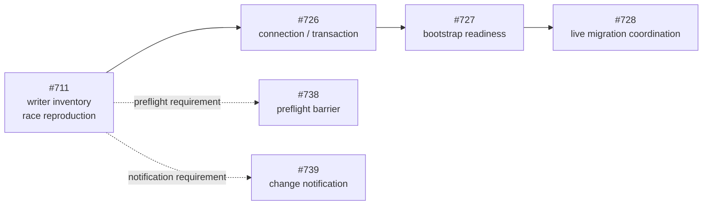

# TABBIN Issue #711 技術投資委員会メモ

Persistence Model v2 / Concurrency Analysis

| 項目       | 内容                                                              |
| ---------- | ----------------------------------------------------------------- |
| 宛先       | TABBIN maintainers / v2 decision makers                           |
| 判断依頼   | P0 の writer inventory・race test を条件付き承認する              |
| 判断根拠   | Issue #711 本文・追加コメント（2026-07-16 参照）                  |
| 金額・尺度 | 非適用。予算・工数・財務情報は未提示                              |
| 文書の役割 | Issue #711 の判断材料。実装仕様や writer inventory の代替ではない |

## 1. エグゼクティブサマリー

### 推奨

**条件付き承認**を推奨する。

P0 として writer inventory と race の再現を実施し、現在の
module-global Promise queue を cross-context 競合や Manifest V3 service
worker restart に対する最終保証として扱わない。

ただし、IndexedDB 移行自体は本判断に含めない。Issue #711 では現行
`chrome.storage` の保証境界と移行要件を明らかにし、実装は #726〜#728 へ
引き渡す。

### 承認対象

- storage key ごとの writer / reader / read-modify-write 経路の inventory
- cross-context、service worker restart、migration 競合の再現 test
- cache invalidation / conflict detection 方針の決定
- preflight / migration barrier への参加 matrix
- #726〜#739 へ渡す concurrency / notification requirement

### 承認対象外

- IndexedDB migration の実装
- Persistence Model v2 全体の一括承認
- 情報が提示されていない予算・headcount・期日・財務リターン
- test で必要性を証明していない恒久的な revision layer

### 判断の要点

| 観点             | 判断                                                                                       |
| ---------------- | ------------------------------------------------------------------------------------------ |
| なぜ今か         | 複数 context と MV3 restart に対し、module-global queue の保証が届かない                   |
| 判断を支える証拠 | Issue 本文が writer 経路、stale cache、lost update、migration 競合を P0 として明示している |
| 最大の失敗要因   | `get` / `load` / `read` という名称から read-only と誤認し、implicit writer を漏らすこと    |
| 妥当な投資範囲   | analysis、regression proof、requirement handoff に限定した discovery                       |
| 主要成果物       | writer matrix、race/restart test、cache decision、barrier matrix、Issue 間 handoff         |

## 2. 投資仮説

### 仮説 1: queue の保証境界を明確にする

module-global Promise queue は、同一 JavaScript runtime 内の
read-modify-write 直列化には有効である。一方、独立した extension context
間の lost update や service worker restart 後の correctness は保証しない。
race test でこの境界を再現できることを成立条件とする。

### 仮説 2: v2 設計前の writer inventory が移行リスクを下げる

次の storage key について、明示・暗黙の全 mutation を actual storage write
まで追跡する。

- `savedTabs`
- `urls`
- `customProjects`
- `parentCategories`
- `userSettings`
- AI chat history
- analytics views

結果を #726 の transaction 設計、#727 の readiness、#728 の migration
coordination、#739 の change notification 設計へ渡す。

### 仮説 3: current layer の修正は期限付きかつ最小にする

cache invalidation、revision、authoritative writer は、race test で必要性を
示した場合のみ current layer へ追加する。#729 で現行 storage module の撤去が
予定されるため、v2 の恒久 architecture を先回りして重複実装しない。

## 3. 対象システムと利用価値

TABBIN は Manifest V3 browser extension であり、background、options、
saved-tabs など複数 context が同じ storage を更新し得る。本判断は
Persistence Model v2 Epic #724 の事前 inventory / concurrency analysis である。

### 対象となる writer category

関数名ではなく actual storage mutation の有無で分類する。

- explicit save / update / delete
- implicit repair / write-back
- normalize-on-read
- self-healing load
- startup migration
- scheduled maintenance / alarm
- UI synchronization
- background listener
- import / restore
- cleanup

### 利用価値

- lost update を防止または検出できる
- stale cache / stale UI の発生条件を明らかにできる
- preflight snapshot と normal write の競合を扱える
- live migration 中の writer coordination requirement を確定できる
- #726 以降の transaction / bootstrap / migration 設計の手戻りを減らせる

顧客数、売上、利用頻度などの事業 KPI は Issue #711 に提示されていない。

## 4. 市場機会と適用範囲

市場規模、顧客数、価格、売上、TAM / SAM / SOM は本判断に非適用である。
これは事業投資ではなく、P0 の persistence correctness risk に対する限定的な
engineering 投資判断である。

### 到達可能な技術範囲

- 近接範囲: current `chrome.storage` write model の inventory と regression proof
- #726: IndexedDB connection / transaction
- #727: `PersistenceBootstrap` readiness
- #728: live migration ownership / coordination
- #738: preflight と normal write の barrier
- #739: change notification の scope / expectation

投資価値は定量 ROI ではなく、writer 漏れと lost update の再発を防ぐための
基礎証拠に置く。

## 5. 所有権とガバナンス

株式、負債、希薄化、market cap は非適用である。代わりに Issue 間の
decision rights と段階承認を管理する。

| Issue | 所有する判断・成果                                                    |
| ----- | --------------------------------------------------------------------- |
| #711  | writer inventory、race reproduction、cache / coordination requirement |
| #726  | IndexedDB connection / transaction model                              |
| #727  | `PersistenceBootstrap` readiness                                      |
| #728  | live migration ownership / coordination                               |
| #729  | current storage module の撤去                                         |
| #738  | preflight barrier / source fingerprint                                |
| #739  | change notification scope / expectation                               |

Issue 境界を跨ぐ判断は、暗黙に共有せず handoff として記録する。

## 6. 技術的選択肢と比較

| 選択肢                | 有効な範囲                                | 主な弱点                                         | 本判断での扱い                           |
| --------------------- | ----------------------------------------- | ------------------------------------------------ | ---------------------------------------- |
| 現行 Promise queue    | 同一 runtime 内の直列化                   | cross-context と restart を保証しない            | 保証境界を test で明示する               |
| authoritative writer  | cross-context command 境界                | 集約経路自体が temporary architecture になり得る | inventory が必要性を示した場合に検討する |
| temporary revision    | current storage 期間の conflict detection | #726 の transaction model と重複し得る           | test で必要性を示した最小範囲に限定する  |
| IndexedDB transaction | v2 の恒久 transaction guarantee           | #711 の実装範囲外                                | requirement を #726 へ渡す               |

現時点では単一方式へ固定しない。まず writer と競合 path を漏れなく観測し、
current layer に必要な最小対策と #726 で解く要件を分離する。

## 7. 実行体制

Issue 本文とコメントには、実装所有者、承認者、担当人数が指定されていない。
実行開始前に次の owner を割り当てる。

- inventory owner
- race / restart test owner
- cache decision owner
- #726〜#739 handoff owner

成功条件は、関数名ではなく actual storage mutation まで追跡し、preflight /
migration barrier と change notification expectation を同じ判断記録へ統合する
ことである。

## 8. 実績と主要オペレーティング指標

現行実装には URL record / savedTabs 関連の in-memory mutation queue と cache が
ある。一方、race 発生件数、lost update 率、cache stale 率などの時系列 KPI は
提示されていない。したがって、成果は定量成長ではなく再現可能な correctness
evidence で測る。

### 必須の writer matrix

storage key ごとに最低限、次を記録する。

| 項目                 | 記録内容                                                  |
| -------------------- | --------------------------------------------------------- |
| writer               | actual storage mutation に到達する入口                    |
| context              | background / options / saved-tabs / listener / alarm など |
| read keys            | mutation 前に読む key                                     |
| write keys           | mutation する key                                         |
| RMW                  | read-modify-write の有無                                  |
| current coordination | queue / cache / listener の関与                           |
| migration conflict   | preflight / migration / normal write との競合             |
| v2 target            | #726〜#739 の引き渡し先                                   |

### 必須の regression evidence

- 独立 writer A / B が同じ snapshot を更新する race
- URL create / delete の競合
- `savedTabs` / `customProjects` の競合
- 外部 `chrome.storage` update による cache invalidation
- service worker restart 前後の mutation
- preflight snapshot と normal write の競合
- live migration と implicit writer の競合

すべて deterministic に再現できる test を目標とする。未分類 path または再現不能な
競合が残る場合、承認条件は未達とする。

## 9. Engineering 投資と scope economics

予算、headcount、期間見積り、過去の engineering spend は情報未提示であり、
定量 unit economics は算定しない。

便益は lost update、stale cache、migration 競合、transaction 設計の手戻りを
早期に発見することにある。コストは inventory / test / requirement handoff に
限定する。

耐久性の条件は、correctness が module-global queue / cache state に依存せず、
context restart 後も同じ結果になることである。恒久的 transaction guarantee は
#726 が所有する。

## 10. Delivery outlook

予算、担当人数、期日は未提示である。現在の判断では金銭承認を行わず、実装前に
owner と工程を割り当てる。

repository code の full writer inventory は未完了であり、本承認後の diligence
成果物とする。

## 11. 評価とリターン scenario

financial valuation、MOIC、IRR は情報未提示であり評価しない。ここでのリターンは、
「v2 設計前に writer・race・coordination requirement を明らかにできる度合い」
と定義する。

### Downside

inventory が explicit save / delete に偏り、normalize-on-read、startup、alarm、
UI sync、restore を漏らす。一時 revision layer だけが増え、#726 の transaction
requirement が曖昧なまま残る。

### Base

全 writer category と context を inventory し、cross-context / restart /
migration race を再現する。cache policy と barrier matrix を確定し、#726〜#739
へ handoff する。

### Upside

authoritative writer 境界と notification scope が明確になり、#726〜#728 の
設計手戻りと cutover risk を早期に減らす。定量効果は未評価である。

### 3 × 3 定性 sensitivity

評価指標は migration risk reduction。行は writer inventory の網羅性、列は
barrier / coordination の網羅性を表す。

|              | coordination 低 | coordination 中 | coordination 高 |
| ------------ | --------------- | --------------- | --------------- |
| inventory 低 | 不十分          | 不十分          | 限定的          |
| inventory 中 | 限定的          | 中              | 中              |
| inventory 高 | 限定的          | 中              | 高（base）      |

writer inventory と coordination の両方が高い場合のみ、#726 以降へ安全に進む
判断根拠になる。

## 12. 承認条件

本承認は Issue #711 の analysis / test / requirement handoff に限定する。
IndexedDB migration の実装は含めない。

### 完了 gate

- [ ] 全 storage key の writer matrix が埋まっている
- [ ] explicit / implicit writer の未分類 path がない
- [ ] cross-context race を deterministic に再現している
- [ ] MV3 service worker restart を跨ぐ test がある
- [ ] cache invalidation / conflict detection の採否と根拠が記録されている
- [ ] preflight / migration barrier の参加 matrix がある
- [ ] migration と normal write の競合一覧がある
- [ ] #726〜#739 への handoff が記録されている
- [ ] 関連する既存 test が通過している
- [ ] owner と工程が割り当てられている

### 段階承認

| 段階          | 承認状態           | trigger      | 条件                               |
| ------------- | ------------------ | ------------ | ---------------------------------- |
| 現行 baseline | 明示なし           | 現在         | queue / cache inventory            |
| #711          | 条件付き承認を推奨 | #726 前      | 上記 gate をすべて証明             |
| #726          | 別承認             | #711 完了後  | transaction requirement 確定       |
| #727 / #728   | 別承認             | #726 後      | readiness / migration coordination |
| v2 総投入     | 単一承認ではない   | cutover まで | 段階 gate で管理                   |

## 13. 主要リスク、diligence、成立条件

### Risk 1: implicit writer の漏れ

`get` / `load` / `read` という名称から read-only と推測すると、normalize、
repair、write-back、startup migration、alarm、UI sync、restore 等が漏れる。
actual storage mutation まで追跡し、未分類 path をゼロにする。

### Risk 2: cross-context / restart correctness

独立 writer が同じ snapshot を更新する lost update と、queue state を継承しない
restart により correctness が崩れる可能性がある。再現 test と、module-global
state に依存しない target guarantee が必要である。

### Risk 3: temporary layer への過剰投資

revision や authoritative writer を current layer へ広く実装すると、#726 の
transaction model と重複し、#729 の現行 module 撤去を遅らせる。test で必要性を
示した最小対策だけを許可する。

### 判断 blocker

- owner が未割り当て
- writer category が未網羅
- race / restart が未再現
- cache policy が未決
- preflight / migration barrier の参加条件が未整理
- #726〜#739 への handoff が未記録

これらを完了条件として条件付き承認する。

## Source

- [GitHub Issue #711: chrome.storage 更新を cross-context 競合と MV3 service worker restart に耐える設計へ変更する](https://github.com/haruto-yamada1/TABBIN/issues/711)
