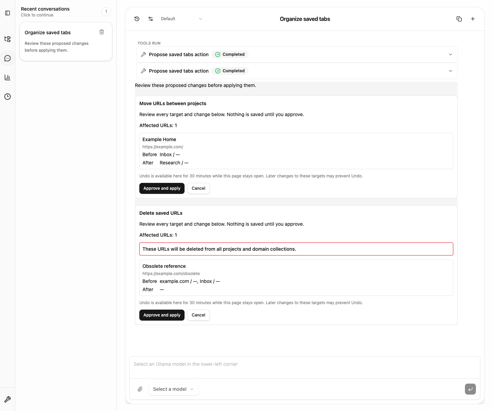

# AI Chat の保存タブ整理

AI Chat は、プロジェクト間の URL 移動、プロジェクト内の既存カテゴリへの分類、
保存 URL の削除、新しい空のプロジェクトの作成を提案できます。
対象は1提案につき最大100件の一意な保存 URL IDです。

1. AI に整理を依頼します。AI は検索結果の URL ID と、既存のプロジェクト・
   カテゴリ・所属 ID を読み取り、構造化した操作提案を返します。
2. 「操作提案を確認」を押し、対象のタイトル・URL・変更前後・件数を確認します。
3. 「承認して実行」を押すと、確認した差分を1回の IndexedDB transaction で保存します。
   確認中に保存データの版が変わった場合は実行を拒否し、再確認を求めます。
4. 「この操作を元に戻す」で、変更したレコードだけを復元できます。
   会話や画面を切り替えて戻った場合にも、同じページ内で Undo を表示します。

削除は対象 URL とそのすべてのプロジェクト・ドメイン所属を削除します。
確認パネルでこの範囲を明示します。複数の所属は重複 URL ではありません。
canonical URL の重複は整合性エラーであり、自動削除の対象にしません。
移動先に同じ URL の所属がすでにある場合も、元のメモや分類情報を失わないよう拒否します。

Undo は実行後30分間、ページを開いている間だけ利用できます。
再読み込み・ページを閉じる操作ではセッション内の Undo 情報が失われます。
有効な Undo は最大20件保持し、枠が埋まった場合は新しい操作を保存前に拒否します。
後から対象レコードが変更された場合は、上書きを防ぐため Undo を拒否します。
対象外への後続の変更は保持します。Undo の保存に失敗した場合は再試行できます。

AI ツールは保存操作への入口を持たず、提案の生成だけを行います。
UI での確認後も application service が入力・対象・所属・整合性を再検証し、
承認の識別子を1回だけ消費して保存します。権限の追加やデータ移行はありません。
保存後の画面通知だけが失敗した場合は、保存成功と Undo を保持し、
他の画面の再読み込みを案内します。

